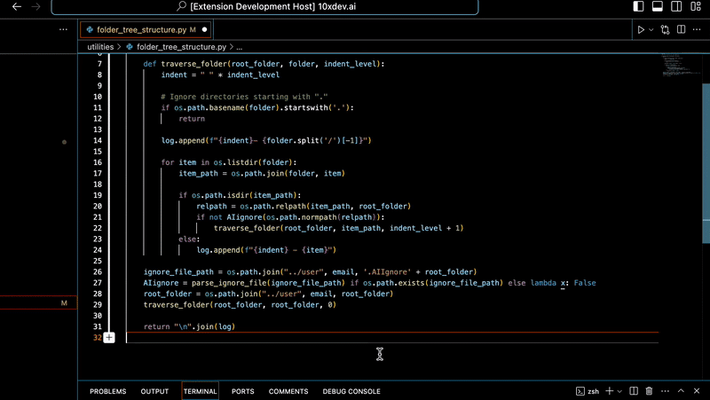

    

yo yo yo

<h1 align="center">DevX AI</h1>

## DevX and AI Inline Code Editor Extension

Edit Code and Chat Inline
### Features

# AI Code editing

  

# Ask AI Inline

  

---

## Settings
You can also change your API key in User Settings via Code -> Preferences -> Settings and under Extensions you will find ScribeAI settings. Or you can just search ScribeAI in search box.

# 🗝️ To find your OpenAI API key:
Go to https://beta.openai.com/account/api-keys. You will need to log in (or sign up) to your OpenAI account.
Click "Create new secret key", and copy it.
You should then paste it into VS Code when prompted.
If you wish to change the AI model you use which by default is code-davinci-002 (because it’s free currently), then you can change it in User Settings.
💥 Remember to restart your extension and workspace when you change your settings. You can do that by clicking on restart your extension in the API key settings 💥

  

